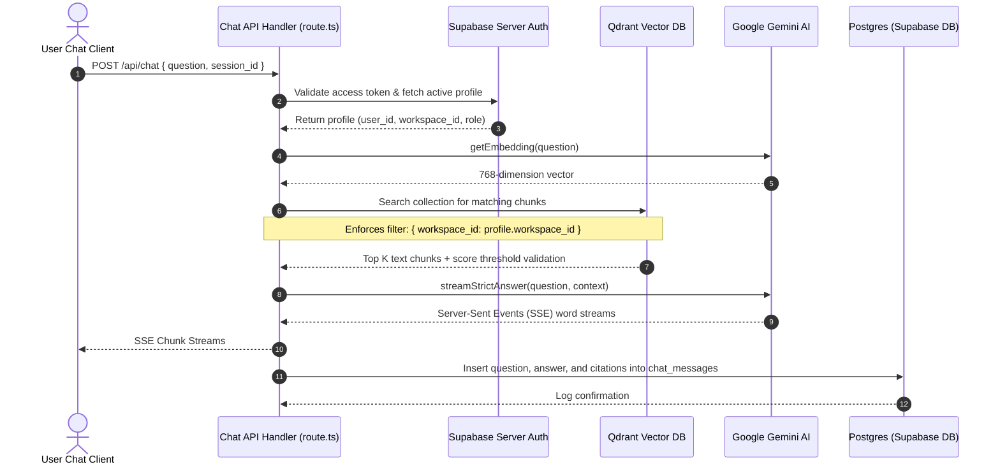

# 🗂️ SpringVox Knowledge AI — Extensive Codebase Architecture & File Structure

This document provides a highly detailed, comprehensive architectural map of the **SpringVox Knowledge AI** repository. It serves as a master developer manual, explaining the directory structure, the purpose and logic of every source file, role-based page protections, database schemas, and AI RAG logic flows.

---

## 🏛️ Architectural Overview

SpringVox is built on a modern, high-performance, enterprise-grade technology stack:
* **Frontend Framework:** Next.js 16.2 (App Router) utilizing React Server Components (RSC) and Client Components with Turbopack for lightning-fast compilation.
* **Styling & System Design:** Tailwind CSS for modular responsive interfaces, standardizing typography padding, dark modes, and layout grids.
* **Database & Auth (BaaS):** Supabase (PostgreSQL) for user session management, token validation, real-time database reactivity, and secure Row-Level Security (RLS) configurations.
* **Neural Vector Store:** Qdrant DB for storing high-dimensional text chunk embeddings and performing semantic similarity queries.
* **Inference Engine:** Google Gemini AI (`gemini-1.5-flash` and `gemini-embedding-001`) for creating vector representations and generating strict, context-grounded citations answers.

---

## 🌳 Interactive File Structure Tree

```
springvox-knowledge-ai/
├── app/                              # Next.js 16.2 App Router (Pages & API Routes)
│   ├── api/                          # Serverless API Endpoints (POST, GET, DELETE, etc.)
│   │   ├── analytics/                # Telemetry & workspace query metrics APIs
│   │   ├── auth/                     # Registration, login pipelines, and invite joins
│   │   ├── chat/                     # RAG streaming logic & conversation history APIs
│   │   ├── documents/                # File upload (PDF/TXT) parsing & vector ingestion
│   │   ├── feedback/                 # User response helpfulness ratings (Thumbs Up/Down)
│   │   ├── invitations/              # Tenant team member invitations and tokens
│   │   ├── knowledge-gaps/           # Unresolved user query detection & metrics
│   │   ├── platform/                 # Global admin governance control APIs
│   │   ├── sources/                  # Citations & chunk previews retrievers
│   │   ├── users/                    # Workspace profile list & role assignments
│   │   ├── workspace/                # Tenant settings updates (branding, operational status)
│   │   └── workspaces/               # Workspace creation, slug checking, onboarding
│   ├── dashboard/                    # Workspace Member & Admin dashboard views
│   │   ├── analytics/                # Command Center charts (Recharts)
│   │   ├── chat/                     # High-fidelity RAG chat view
│   │   ├── documents/                # File management (upload, delete, status tracking)
│   │   ├── knowledge-gaps/           # Telemetry panel for unanswered questions
│   │   ├── settings/                 # Workspace styling, logo updates, team control
│   │   ├── upload/                   # PDF & TXT file upload wizard
│   │   └── users/                    # Team user control board
│   ├── platform/                     # Super Administrator console pages
│   ├── globals.css                   # Global Tailwind configuration & typography standards
│   ├── layout.tsx                    # Top-level global HTML container
│   └── page.tsx                      # Public marketing landing page
├── sql/                              # Supabase DDL SQL Migrations (Schemas & Security)
│   ├── advanced_mvp_features.sql     # Indexes, gaps table, & performance tuning
│   ├── chat_sessions.sql             # Chat isolation & historical sessions schemas
│   ├── organisation_onboarding.sql   # Onboarding structures & plan records
│   ├── platform_admin_console.sql    # Super Admin metrics tables
│   ├── role_model_platform_tenant.sql# RBAC schemas, custom functions, & core RLS rules
│   ├── tenant_branding_invites_...   # Brand states, analytics, and invites schemas
│   └── workspace_mvp.sql             # Initial workspace and profiles seed schemas
├── src/                              # Main Code Repository Source
│   ├── components/                   # Reusable React & TSX Visual Components
│   │   ├── brand/                    # SpringVox logos & marks
│   │   ├── dashboard/                # Analytics widgets and custom inputs
│   │   ├── landing/                  # Landing page sections (Hero, Features, Pricing)
│   │   ├── layout/                   # Safe page containers & overflow guards
│   │   ├── platform/                 # Super-admin data tables & controls
│   │   ├── shared/                   # Header bars & custom banners
│   │   └── ui/                       # Core elements (buttons, confirm dialogues, drawers)
│   └── lib/                          # Core Services, API Client Files, & Utilities
│       ├── api-errors.ts             # Global API response sanitizers
│       ├── auth-client.ts            # Client-side session and profile helpers
│       ├── chat-sessions.ts          # Chat session creation and history resolvers
│       ├── documents.ts              # File chunking & filename sanitizers
│       ├── gemini.ts                 # Gemini API embeds & temperature parameters
│       ├── qdrant.ts                 # Qdrant client connection & upsert hooks
│       ├── supabase-server.ts        # Server-side auth verify & service role clients
│       ├── supabase.ts               # Standard web-client BaaS connections
│       ├── workspace-access.ts       # Active tenant lock-guards
│       └── workspace.ts              # Role helpers, labels, and enums
├── package.json                      # NPM Dependencies & Turbopack dev scripts
├── tsconfig.json                     # Typescript rules & absolute path routing
├── next.config.mjs                   # Next.js settings & security HTTP headers
└── memory-security.md                # Tailored AI Security Engineering tracker
```

---

## 📂 Section 1: Next.js App Router UI (`app/`)

The `app/` directory handles routing, static templates, layout wrapping, and React Server Components vs. Client Component boundaries.

### 1. Root & Public Marketing Pages
*   **[app/page.tsx](file:///home/water/Downloads/springvox-knowledge-ai/app/page.tsx):** The public-facing entry point containing the enterprise landing page. It showcases the value proposition of SpringVox Knowledge AI, features clean grid elements, features responsive mobile structures, and links to `/login` and `/get-started`.
*   **[app/layout.tsx](file:///home/water/Downloads/springvox-knowledge-ai/app/layout.tsx):** The primary root layout file that loads global typography (e.g. Google Fonts) and embeds the HTML tags and global context hooks.
*   **[app/globals.css](file:///home/water/Downloads/springvox-knowledge-ai/app/globals.css):** Standardizes the CSS system design. It contains:
    - Standard color tokens (HSL variables tailored to a slate-gray-cyan palette).
    - Glassmorphism classes (`.backdrop-blur-xl`).
    - Input focus transitions, smooth gradients, and scrollbars.

### 2. Workspace User Dashboard Router (`app/dashboard/`)
The main user workspace interface. Access requires a valid user session.
*   **[app/dashboard/layout.tsx](file:///home/water/Downloads/springvox-knowledge-ai/app/dashboard/layout.tsx):** Implements the central dashboard layout. It renders the primary navigation sidebar (light/dark theme toggle, link lists), tracks user workspace information, and enforces responsive mobile sheet overrides.
*   **[app/dashboard/page.tsx](file:///home/water/Downloads/springvox-knowledge-ai/app/dashboard/page.tsx):** The main workspace landing page. Renders workspace overview cards, storage status widgets, a summary of recent uploads, and links to core features.
*   **[app/dashboard/chat/page.tsx](file:///home/water/Downloads/springvox-knowledge-ai/app/dashboard/chat/page.tsx):** The core chat workspace. It features:
    - Standard ReactMarkdown response parsing.
    - Word-by-word streaming queues.
    - Elapsed response telemetry counters.
    - Historical chat session side-drawers.
    - Accordion citation section lists and citation drawers.
*   **[app/dashboard/documents/page.tsx](file:///home/water/Downloads/springvox-knowledge-ai/app/dashboard/documents/page.tsx):** Document management control center. Accessible to Workspace Administrators (`tenant_admin`, `platform_admin`). Renders pagination tables, file search bars, upload status indicators, and file-delete modal triggers.
*   **[app/dashboard/knowledge-gaps/page.tsx](file:///home/water/Downloads/springvox-knowledge-ai/app/dashboard/knowledge-gaps/page.tsx):** A high-integrity telemetry table tracking user queries that returned `"I don't know based on the uploaded documents."`. This allows workspace owners to see exactly what documentation needs to be created or uploaded.
*   **[app/dashboard/settings/page.tsx](file:///home/water/Downloads/springvox-knowledge-ai/app/dashboard/settings/page.tsx):** Contains tenant management tabs:
    - *Branding:* Allowed logo changes, title updates, and primary color configurations.
    - *Team management:* Enforces member listings, role escalation boards, and team invitations.
*   **[app/dashboard/upload/page.tsx](file:///home/water/Downloads/springvox-knowledge-ai/app/dashboard/upload/page.tsx):** Provides a visual file drag-and-drop zone for document ingestion. Handles multi-file batches and renders real-time chunking progress bars.

### 3. Platform Super-Admin Console (`app/platform/`)
*   **[app/platform/layout.tsx](file:///home/water/Downloads/springvox-knowledge-ai/app/platform/layout.tsx):** Defines the super-admin navigation shell. Ensures that a user role strictly matches `platform_admin`, immediately redirecting invalid users back to their respective workspace.
*   **[app/platform/page.tsx](file:///home/water/Downloads/springvox-knowledge-ai/app/platform/page.tsx):** Overview metrics console for the entire platform: active workspaces count, platform users list, billing tiers breakdown, and health telemetry.
*   **[app/platform/companies/page.tsx](file:///home/water/Downloads/springvox-knowledge-ai/app/platform/companies/page.tsx):** Allows global administrators to view, suspend, or reactivate all tenant companies, edit administrative notes, and adjust pricing limits.
*   **[app/platform/users/page.tsx](file:///home/water/Downloads/springvox-knowledge-ai/app/platform/users/page.tsx):** Enforces a global directory view of all registered accounts across all tenant organizations.

---

## 🔌 Section 2: Serverless API Endpoints (`app/api/`)

All backend logic runs in serverless functions located under `app/api/`. These enforce strict role-based access control (RBAC).

### 1. Document Ingestion Pipeline
*   **[app/api/documents/upload/route.ts](file:///home/water/Downloads/springvox-knowledge-ai/app/api/documents/upload/route.ts):** Orchestrates PDF and TXT ingestion:
    - Checks authorization (only admins are allowed).
    - Checks file boundaries (4MB size limit).
    - Parses text using `pdf-parse`.
    - Generates 768-dimension vectors for each chunk via `gemini-embedding-001`.
    - Writes records to Supabase tables `documents` and `document_chunks`.
    - Upserts vectors and metadata into Qdrant collection points.
*   **[app/api/documents/delete/route.ts](file:///home/water/Downloads/springvox-knowledge-ai/app/api/documents/delete/route.ts):** Orchestrates safe document deletions. Deletes Qdrant point matrices matching the document ID, purges local storage buckets, and deletes database database rows.

### 2. Conversational RAG Engine
*   **[app/api/chat/route.ts](file:///home/water/Downloads/springvox-knowledge-ai/app/api/chat/route.ts):** Performs the heavy RAG processing:
    - Evaluates the user's prompt vector via Gemini embeddings.
    - Searches Qdrant vectors with a score threshold filter (minimum `0.55`) and **strict workspace partition checks**.
    - Queries Supabase for document metadata to construct citations.
    - Generates and streams a strict, context-grounded answer back to the frontend using Server-Sent Events (SSE).
    - Logs unanswered queries as knowledge gaps and saves conversation logs to `chat_messages`.
*   **[app/api/chat/sessions/route.ts](file:///home/water/Downloads/springvox-knowledge-ai/app/api/chat/sessions/route.ts):** Exposes GET, POST, and DELETE actions for historical user chat sessions, sandboxed to the active profile's ID.

### 3. Invitation and Organization Management
*   **[app/api/invitations/route.ts](file:///home/water/Downloads/springvox-knowledge-ai/app/api/invitations/route.ts):** Generates securely signed invitation tokens, logs them to `invitations`, and maps them to a specific tenant workspace ID.
*   **[app/api/invitations/accept/route.ts](file:///home/water/Downloads/springvox-knowledge-ai/app/api/invitations/accept/route.ts):** Joins a newly registered user profile to the target workspace if the invitation signature matches and has not expired.
*   **[app/api/workspaces/create/route.ts](file:///home/water/Downloads/springvox-knowledge-ai/app/api/workspaces/create/route.ts):** Performs initial enterprise onboarding by creating workspace slugs, configuring initial administrative profiles, and assigning custom limits.

---

## 🛠️ Section 3: Core Libraries & Helpers (`src/lib/`)

The `src/lib/` folder contains structural modules, AI client parameters, and authorization libraries.

*   **[src/lib/supabase-server.ts](file:///home/water/Downloads/springvox-knowledge-ai/src/lib/supabase-server.ts):** Exports secure server-side client creators. Evaluates incoming request headers for active Bearer tokens and executes actual user verifications against Supabase Auth.
*   **[src/lib/supabase.ts](file:///home/water/Downloads/springvox-knowledge-ai/src/lib/supabase.ts):** Initializes the standard client-side Supabase connection.
*   **[src/lib/gemini.ts](file:///home/water/Downloads/springvox-knowledge-ai/src/lib/gemini.ts):** Configuration module for Google Generative AI:
    - Sets strict system prompts instructing Gemini to answer *only* from the provided context.
    - Caps temperatures at `0.1` to ensure highly deterministic, injection-resistant answers.
*   **[src/lib/qdrant.ts](file:///home/water/Downloads/springvox-knowledge-ai/src/lib/qdrant.ts):** Manages vector database connections and establishes collection schemas.
*   **[src/lib/workspace.ts](file:///home/water/Downloads/springvox-knowledge-ai/src/lib/workspace.ts):** Holds structural user role labels (`platform_admin`, `tenant_admin`, `viewer`) and role hierarchy arrays.
*   **[src/lib/workspace-access.ts](file:///home/water/Downloads/springvox-knowledge-ai/src/lib/workspace-access.ts):** Contains active tenant status checks. Ensures suspended organizations cannot call API handlers or search documents.
*   **[src/lib/documents.ts](file:///home/water/Downloads/springvox-knowledge-ai/src/lib/documents.ts):** Implements document parsing utilities:
    - Cleans filenames using regex to prevent directory traversals.
    - Groups text into optimal sizes for vector search (e.g. 1000 characters with 200 character overlaps).

---

## 📊 Section 4: Visual Components (`src/components/`)

Visual elements are modularized to keep App pages lightweight.

*   **`src/components/ui/`**: Premium global UI building blocks, including:
    - `app-button.tsx`: Sleek custom button elements supporting color states.
    - `confirm-dialog.tsx`: Generic accessibility modal windows used for deleting documents or chats.
*   **`src/components/landing/`**: Renders the marketing landing page components (Hero layout grids, CTA strips, features listings).
*   **`src/components/dashboard/`**:
    - `ViewerChatSidebarHistory.tsx`: A visually polished sidebar designed for chat lists.
    - `AdminSearchInput.tsx`: An accessible search input bar that standardizes magnifying glass padding.
*   **`src/components/brand/`**: Contains the standard SpringVox brand marks, keeping logo presentation unified across layouts.

---

## 💾 Section 5: Database Migrations (`sql/`)

Located in `/sql`, these migrations define the relational schema constraints, triggers, and Row-Level Security policies.

*   **[sql/role_model_platform_tenant.sql](file:///home/water/Downloads/springvox-knowledge-ai/sql/role_model_platform_tenant.sql):** The foundation of SpringVox security:
    - Creates tables `workspaces` and `profiles`.
    - Establishes check constraints enforcing `role in ('platform_admin', 'tenant_admin', 'viewer')`.
    - Creates the `handle_new_user_profile()` trigger function that automatically assigns the secure `viewer` role to new signups by default.
    - Defines policies isolating select actions to verified workspace members.
*   **[sql/chat_sessions.sql](file:///home/water/Downloads/springvox-knowledge-ai/sql/chat_sessions.sql):** Defines the conversation schema:
    - Establishes `chat_sessions` and binds them to workspaces and user accounts.
    - Configures database triggers that auto-update `updated_at` timestamps on chat activity.
    - Configures sandbox policies:
      `user_id = auth.uid() and exists (select 1 from public.profiles p where p.id = auth.uid() and p.workspace_id = chat_sessions.workspace_id)`
*   **[sql/tenant_branding_invites_analytics_feedback.sql](file:///home/water/Downloads/springvox-knowledge-ai/sql/tenant_branding_invites_analytics_feedback.sql):** Implements organization branding variables, secure team invitations logic, and analytics logging tables.

---

## 🚀 Architectural Summary of the RAG Flow

The following diagram illustrates how these components interact during a user query:


