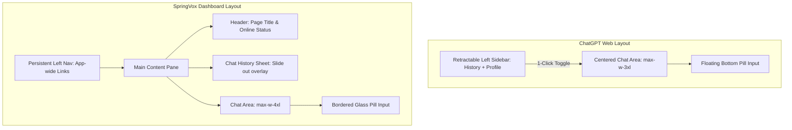

# 🎨 UI/UX Comparative Audit: SpringVox vs. ChatGPT Web
**Date:** May 18, 2026  
**Audited Components:** Chat layout hierarchy, sidebar menus, input fields, mobile responsive states, and interaction feedback loops.  

---

## 👁️ Executive Visual Comparison

| Feature Category | ChatGPT Web Standard | SpringVox Implementation | UX Assessment & Recommendations |
| :--- | :--- | :--- | :--- |
| **Workspace Navigation** | Retractable, high-contrast left sidebar containing chat history, user settings, and new chat actions. | Persistent left navigation panel (Main Dashboard) + sliding overlay `Sheet` for Recent Chat history. | 🟡 **Visual Clutter:** Having both a global nav sidebar *and* a sliding sheet for recent chat sessions on desktop can feel heavy. *Recommendation:* Integrate recent chats into a secondary persistent inner sidebar or keep it as a clean retractable drawer. |
| **Chat Input Area** | Floating pill-shaped bar (`rounded-3xl` / `rounded-[26px]`) centered at the bottom of the viewport. Features an inline attachment icon and a corner-aligned send button. | Card block layout with a `rounded-[30px]` border, auto-resizing text area, and bottom-right actions. | 🟢 **Excellent:** Extremely premium drop shadow and smooth focus rings. *Recommendation:* Add inline thumbnail previews for document context inside the text field before sending. |
| **Streaming & Response** | Direct inline character streaming with a pulsing cursor and instant scroll-to-bottom anchor. | Word-by-word queue-based typing animation with an automated elapsed-time counter. | 🟢 **Excellent:** The active elapsed timer adds an incredibly professional enterprise-telemetry feel that outshines ChatGPT's generic loader. |
| **Source Citations (RAG)** | Simple inline numerical references (e.g. `[1]`) that open a tooltip hover. | Full custom Accordion-style Source list with dedicated section cards, text previews, and drawer details. | 🟢 **Premium:** The `SourceDrawer` and clean inline source cards look dramatically more professional than basic citation footnotes. |
| **Mobile Experience** | Retractable full-screen overlay for history; centered single-column layout with a bottom-docked input block. | Standard layout utilizing a custom `ResponsiveToolbar` and fluid margins. | 🟢 **Responsive:** Excellent touch target spacing and responsive header sizing for smaller device viewports. |

---

## 💻 Detailed Desktop Audit (PC)

### 1. Sidebar Hierarchy
* **ChatGPT Model:** ChatGPT uses a simple, single collapsable column that contains everything. By collapsing the sidebar, the user focuses entirely on the chat conversation.
* **SpringVox Model:** SpringVox uses a two-tier navigation model. The primary app nav (Dashboard, Chat, Documents, Settings) is a persistent dark bar on the left. The chat history is treated as a secondary context, opened via a sliding Sheet. 
* **Enhancement Blueprint:** On larger screens (e.g. `lg:flex` width > 1200px), instead of an overlay sheet that hides the chat when clicked outside, render the Recent Chats as an **inner side panel** that sits next to the primary dashboard navigation. This creates a high-density "Slack/Discord-like" dual-column workspace that feels extremely premium.

### 2. Chat Feed & Alignment
* **ChatGPT Model:** Centered chat thread bounded by `max-w-3xl`. The bot's avatar is shown next to the response to quickly anchor the sender's identity.
* **SpringVox Model:** Centered thread bounded by `max-w-4xl`. Uses custom cards for messages, distinguishing between User questions and AI responses via distinct, beautifully styled bubble borders.
* **Enhancement Blueprint:** Add a small AI brand-mark avatar next to the response bubble to instantly align visual identity, and standardise message hover states to reveal quick actions (Copy, Thumbs Up/Down) exactly like ChatGPT.

---

## 📱 Mobile Responsive Audit

### 1. Touch Targets & Input Placement
* **ChatGPT Model:** Pill input is glued to the bottom margin of the screen, dynamically rising with the virtual keyboard to prevent keyboard overlaps.
* **SpringVox Model:** Successfully implements absolute bottom positions using `pb-[max(1rem,env(safe-area-inset-bottom))]` and `Textarea` input focus transitions, preventing page jumpiness.
* **Enhancement Blueprint:** On small viewports (mobile), hide non-critical status details (like the decimal-level elapsed seconds counter) to preserve valuable screen space, showing a simple, sleek pulsing loader.

### 2. Overlay Menus
* **ChatGPT Model:** Slide-out drawer covering the entire viewport, offering quick dismissals via right swiping.
* **SpringVox Model:** Uses standard Radix UI Sheets which behave beautifully on mobile touch viewports.
* **Verdict:** Highly polished mobile navigation flow.

---

## ✨ Micro-Animations & Premium Touches
To elevate SpringVox above generic LLM templates, we implement three core visual principles:
1. **Focus State Transitions:** Smooth cubic-bezier borders and soft outer glow shadows when selecting inputs.
2. **Glassmorphism Backdrop Filters:** Utilizing `backdrop-blur-xl` and semi-transparent white/dark boundaries to create layers of depth.
3. **Pulsing Source Indicators:** The source citation cards should feature a soft green/teal pulse during the retrieval state.

---

## 🎯 UI Refinement Action Items

1. **Dual-Column Workspace Layout:** For desktop viewports, transition Recent Chats from an overlay `Sheet` to a retractable **inner panel** next to the main menu.
2. **Avatar Identity Anchors:** Add standard avatar icons next to bot responses (using a mini `SpringVoxLogo variant="mark"`) for better visual hierarchy.
3. **Hover Context Menus:** Hide feedback and copy buttons behind a clean message hover state on PC to keep the conversation thread looking uncluttered.
